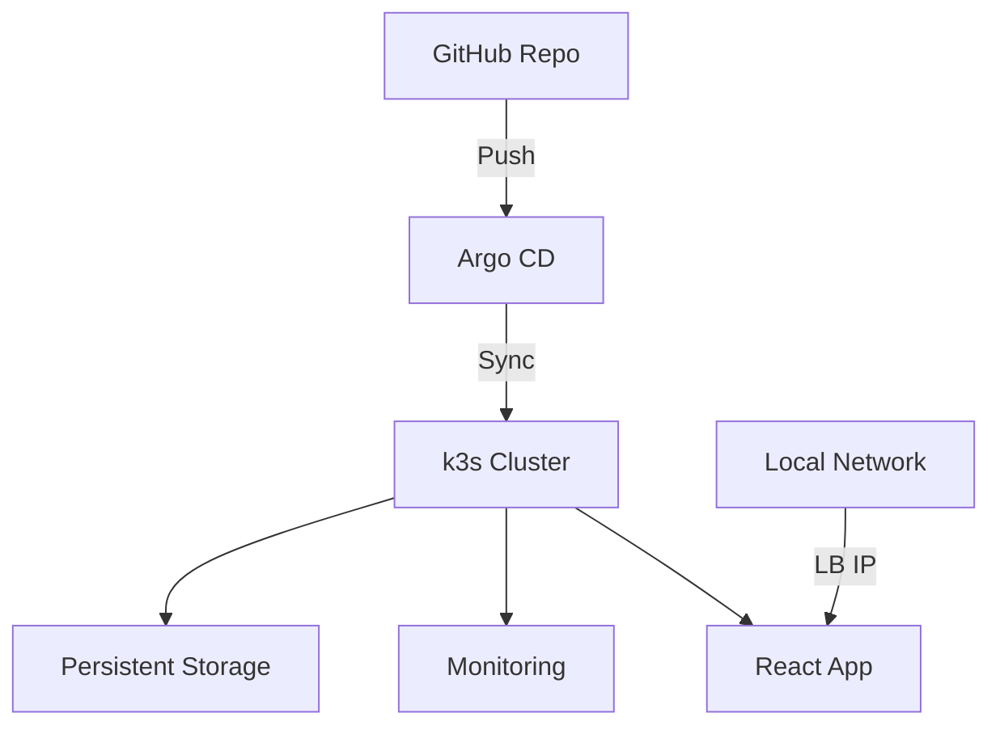

# Home Server GitOps Platform

Production-grade Kubernetes home server with full GitOps workflow.

## Features

- 🔒 Secure SSH access with automatic key rotation
- ☸️ Lightweight k3s Kubernetes cluster
- 🔄 Argo CD GitOps with auto-sync
- 📊 Monitoring stack (Prometheus/Grafana)
- 💾 Persistent storage with local-path provisioner
- 🤖 Automated backups and disaster recovery

## Prerequisites

- Ubuntu 22.04 LTS Server
- 4GB+ RAM (8GB recommended)
- SSD for Kubernetes workloads
- Static IP address

## Quick Start

```bash
# Bootstrap server
ansible-playbook -i ansible/inventory ansible/playbook.yaml

# Deploy base infrastructure
kustomize build k3s/base | kubectl apply -f -
kustomize build k3s/overlays/production | kubectl apply -f -

# Install Argo CD
kustomize build argo/base | kubectl apply -f -

# Access Argo CD UI
kubectl -n argocd get secret argocd-initial-admin-secret -o jsonpath="{.data.password}" | base64 -d
kubectl port-forward svc/argocd-server -n argocd 8080:443
```

````

## Architecture



## Maintenance

**Backup etcd**:

```bash
./scripts/backup-etcd.sh
```

**Upgrade k3s**:

```bash
ansible-playbook -i ansible/inventory ansible/playbook.yaml --tags k3s-upgrade
```

**Monitor Resources**:

```bash
kubectl top pods --all-namespaces
```

## Security Best Practices

1. Enable Argo CD SSO integration
2. Rotate admin password after initial setup
3. Use network policies to isolate workloads
4. Enable automatic security updates
5. Regular vulnerability scans with Trivy

## Troubleshooting

**Argo CD Sync Issues**:

```bash
argocd app get <app-name> --hard-refresh
```

**Node Resource Exhaustion**:

```bash
kubectl describe node | grep -A 3 Allocated
```

**Persistent Volume Recovery**:

```bash
sudo ls -lh /var/lib/rancher/k3s/storage
```

## License

MIT License - See [LICENSE](LICENSE) for details.

```

**Key Components Explained**:

1. **Ansible Automation**:
   - Handles OS hardening and k3s installation
   - Configures zram for memory optimization
   - Sets up automated etcd snapshots

2. **Kustomize Layers**:
   - Base configuration for cluster essentials
   - Production overlay with MetalLB load balancer
   - Environment-specific patches

3. **Argo CD GitOps**:
   - App-of-Apps pattern for managing deployments
   - Automatic synchronization every 3 minutes
   - Self-healing capabilities

4. **Monitoring Stack**:
   - Prometheus with 15-day retention
   - Grafana with preconfigured dashboards
   - Alertmanager for critical notifications

**Post-Installation Steps**:

1. Configure DNS records for your services
2. Set up OAuth2 proxy for Argo CD access
3. Enable encrypted backups to cloud storage
4. Configure network policies for pod isolation

This implementation provides a production-ready home server with full GitOps capabilities while maintaining minimal resource usage. All components can be managed through the Git repository with full audit history.

````
