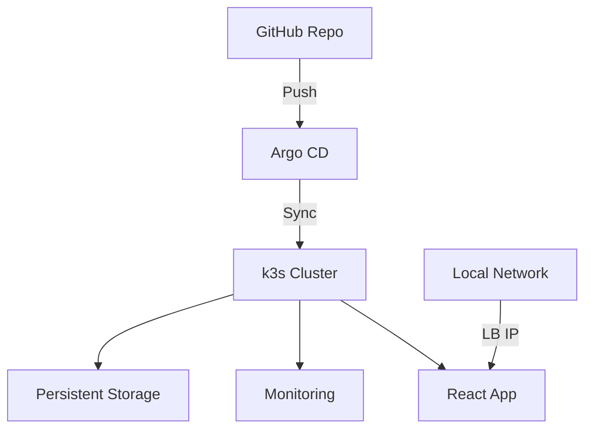

# Home Server GitOps Platform

A **production-grade Kubernetes home server** with a full **GitOps workflow**.

## 🚀 Features

- 🔒 **Secure SSH Access** with automatic key rotation
- ☸️ **Lightweight k3s Kubernetes Cluster**
- 🔄 **Argo CD GitOps** with automatic synchronization
- 📊 **Monitoring Stack** (Prometheus & Grafana)
- 💾 **Persistent Storage** using the Local-Path Provisioner
- 🤖 **Automated Backups** and disaster recovery

---

## 📌 Prerequisites

Ensure you have the following before setting up the home server:

- **Ubuntu 22.04 LTS Server**
- **4GB+ RAM** (8GB recommended)
- **SSD** for optimal Kubernetes performance
- **Static IP Address**
- **SSH access** to the remote server
- **Ansible installed** on your local machine:
  ```sh
  sudo apt install ansible  # For Debian/Ubuntu
  brew install ansible      # For macOS
  ```
- A valid **inventory file (`inventory`)** containing your server details.

---

## ⚡ Quick Start

### **1️⃣ Install & Configure K3s on Remote Server**

Run the following command **after SSHing into the server**:

```sh
ansible-playbook -i ansible/inventory ansible/home-server.yaml
```

This will:
✔ Install required packages  
✔ Set up firewall rules  
✔ Install K3s with custom options  
✔ Configure ZRAM swap

### **2️⃣ Deploy Base Infrastructure & Argo CD**

```sh
# Deploy base infrastructure
kustomize build k3s/base | kubectl apply -f -
kustomize build k3s/overlays/production | kubectl apply -f -

# Install Argo CD
kustomize build argo/base | kubectl apply -f -
kubectl wait -n argocd --for=condition=Ready pods --all --timeout=300s

# Retrieve Argo CD Admin Password
kubectl -n argocd get secret argocd-initial-admin-secret -o jsonpath="{.data.password}" | base64 -d

# Port-forward to access Argo CD UI
kubectl port-forward svc/argocd-server -n argocd 8080:443
```

### **3️⃣ Retrieve K3s Kubeconfig for Local Access**

Run the following command to fetch the `kubeconfig` and set up an SSH tunnel:

```sh
ansible-playbook -i ansible/inventory ansible/k9s-kubeconfig.yaml
```

This will:
✔ Fetch the `kubeconfig` from the remote server  
✔ Modify it for SSH tunnel usage  
✔ Start an SSH tunnel for Kubernetes API access

```sh
# Now use k9s to manage your K3s cluster
k9s
```

---

## 🏗 Architecture



---

## 🛠 Maintenance

### **Backup etcd**

```sh
./scripts/backup-etcd.sh
```

### **Upgrade K3s**

```sh
ansible-playbook -i ansible/inventory ansible/playbook.yaml --tags k3s-upgrade
```

### **Monitor Resource Usage**

```sh
kubectl top pods --all-namespaces
```

---

## 🔒 Security Best Practices

1. **Enable Argo CD SSO Integration** for authentication
2. **Rotate Admin Password** after initial setup
3. **Use Network Policies** to isolate workloads
4. **Enable Automatic Security Updates**
5. **Perform Regular Vulnerability Scans** using [Trivy](https://github.com/aquasecurity/trivy)

---

## 🛠 Troubleshooting

### **Argo CD Sync Issues**

```sh
argocd app get <app-name> --hard-refresh
```

### **Node Resource Exhaustion**

```sh
kubectl describe node | grep -A 3 Allocated
```

### **Persistent Volume Recovery**

```sh
sudo ls -lh /var/lib/rancher/k3s/storage
```

---

## 📜 License

This project is licensed under the **MIT License**. See [LICENSE](LICENSE) for details.

---

## 🔑 Key Components Explained

### 1️⃣ **Ansible Automation**

- Handles **OS hardening** and **K3s installation**
- Configures **ZRAM** for memory optimization
- Sets up **automated etcd snapshots**

### 2️⃣ **Kustomize Layers**

- **Base Configuration** for essential cluster components
- **Production Overlay** with MetalLB load balancer
- **Environment-Specific Patches** for flexibility

### 3️⃣ **Argo CD GitOps Workflow**

- **App-of-Apps Pattern** for managing deployments
- **Automatic Synchronization** every 3 minutes
- **Self-Healing** capabilities

### 4️⃣ **Monitoring Stack**

- **Prometheus** with 15-day data retention
- **Grafana** with preconfigured dashboards
- **Alertmanager** for critical notifications

---

## ✅ Post-Installation Steps

1. **Configure DNS records** for your services
2. **Set up OAuth2 Proxy** for Argo CD access
3. **Enable Encrypted Backups** to cloud storage
4. **Implement Network Policies** for pod isolation

This setup provides a **production-ready home server** with **full GitOps capabilities** while maintaining **minimal resource usage**. All components are managed through the **Git repository**, ensuring full **audit history** and **version control**.

🚀 **Enjoy your Kubernetes Home Server!** 🚀
